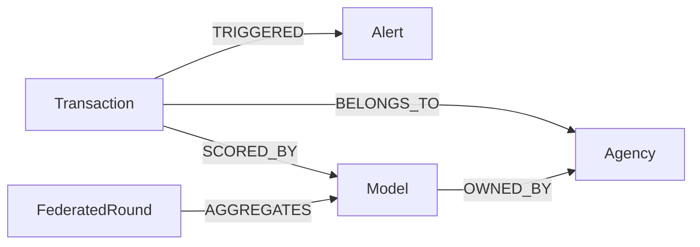
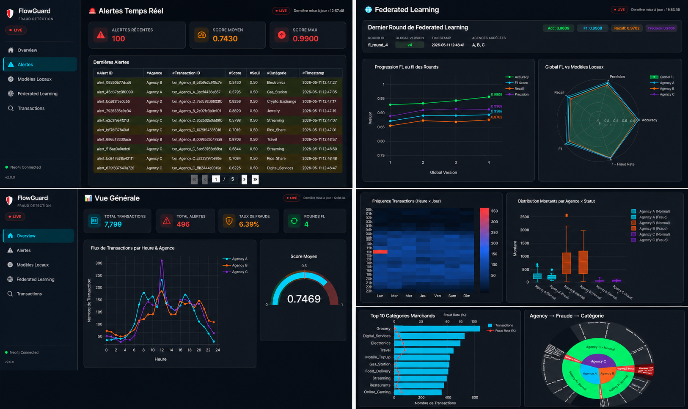

<div align="center">

# 🛡️ FlowGuard

### Real-Time Fraud Detection Pipeline with Federated Learning

[](https://python.org)
[](https://kafka.apache.org)
[](https://neo4j.com)
[](https://scikit-learn.org)
[](https://dash.plotly.com)

---

**FlowGuard** is a streaming Big Data system for **real-time financial fraud detection** across multiple banking agencies.  
It combines **Apache Kafka** for event streaming, **Machine Learning** with online retraining, **Federated Learning (FedAvg)** for privacy-preserving model aggregation, and **Neo4j** as a graph database for full transaction traceability — all monitored through an interactive **Dash dashboard**.

</div>

---

## 📋 Table of Contents

- [Architecture Overview](#-architecture-overview)
- [Key Features](#-key-features)
- [Tech Stack](#-tech-stack)
- [Project Structure](#-project-structure)
- [Neo4j Graph Schema](#-neo4j-graph-schema)
- [Prerequisites](#-prerequisites)
- [Installation](#-installation)
- [Usage](#-usage)
- [Kafka Topics](#-kafka-topics)
- [Machine Learning Pipeline](#-machine-learning-pipeline)
- [Federated Learning](#-federated-learning)
- [Dashboard](#-dashboard)
- [Configuration](#-configuration)
- [Authors](#-authors)

---

## 🏗️ Architecture Overview

```
┌─────────────────────────────────────────────────────────────────────────┐
│                         FlowGuard Pipeline                              │
├─────────────────────────────────────────────────────────────────────────┤
│                                                                         │
│  ┌──────────┐   ┌──────────┐   ┌──────────┐                             │
│  │ Agency A │   │ Agency B │   │ Agency C │   Fake Stream Generators    │
│  └────┬─────┘   └────┬─────┘   └────┬─────┘                             │
│       │              │              │                                   │
│       └──────────────┼──────────────┘                                   │
│                      ▼                                                  │
│          ┌───────────────────────┐                                      │
│          │   Kafka: txn.raw      │                                      │
│          └───────────┬───────────┘                                      │
│                      ▼                                                  │
│          ┌───────────────────────┐                                      │
│          │      Cleaner          │  Validation + Normalisation          │
│          └───────────┬───────────┘                                      │
│                      ▼                                                  │
│          ┌───────────────────────┐                                      │
│          │  Kafka: txn.cleaned   │                                      │
│          └───────────┬───────────┘                                      │
│                      ▼                                                  │
│          ┌───────────────────────┐       ┌──────────────────┐           │
│          │   ML Pipeline         │─────▶│  Kafka: alerts   │           │
│          │  (3 Local Models)     │       └──────────────────┘           │
│          └───────────┬───────────┘                                      │
│                      │                                                  │
│                      ▼                                                  │
│          ┌───────────────────────┐       ┌──────────────────┐           │
│          │ Kafka: model.updates  │─────▶│  FL Aggregator   │           │
│          └───────────────────────┘       │    (FedAvg)      │           │
│                                          └────────┬─────────┘           │
│                                                   ▼                     │
│                                       ┌──────────────────────┐          │
│                                       │  Global Model (FL)   │          │
│                                       └──────────────────────┘          │
│                                                                         │
│       ┌─────────────────────────────────────────┐                       │
│       │              Neo4j (Graph DB)           │                       │
│       │  Transactions ─ Alerts ─ Models ─ FL    │                       │
│       └─────────────────────┬───────────────────┘                       │
│                             ▼                                           │
│              ┌──────────────────────────┐                               │
│              │   Dash Dashboard (8050)  │                               │
│              │  Real-Time Monitoring    │                               │
│              └──────────────────────────┘                               │
│                                                                         │
└─────────────────────────────────────────────────────────────────────────┘
```

---

## ✨ Key Features

| Feature | Description |
|---------|-------------|
| 🔄 **Real-Time Streaming** | Apache Kafka event streaming with multi-topic architecture |
| 🏦 **Multi-Agency Simulation** | 3 banking agencies (A, B, C) with distinct behavioral profiles |
| 🧹 **Data Ingestion & Cleaning** | Automated validation, type-casting and business-rule filtering |
| 🤖 **Online ML** | SGDClassifier with sliding buffer, auto-retraining every 1000 transactions |
| 🌐 **Federated Learning** | FedAvg aggregation across agencies — no raw data sharing |
| 🗄️ **Graph Storage** | Neo4j for full traceability (Transactions → Alerts → Models → FL Rounds) |
| 📊 **Live Dashboard** | Plotly Dash UI with KPI cards, alert feed, model performance charts |
| 🔔 **Alert System** | Real-time fraud alerts when prediction score exceeds threshold |
| 📦 **Model Versioning** | Automatic pickle serialization + JSON metadata per model version |

---

## 🛠️ Tech Stack

| Layer | Technology | Role |
|-------|------------|------|
| **Streaming** | Apache Kafka 3.x | Event bus (transactions, alerts, model updates) |
| **Data Processing** | Python 3.10+ | Core pipeline orchestration |
| **Machine Learning** | Scikit-Learn (SGDClassifier) | Online fraud detection per agency |
| **Federated Learning** | Custom FedAvg | Privacy-preserving model aggregation |
| **Graph Database** | Neo4j 5.x | Transaction/alert/model lineage graph |
| **Dashboard** | Dash + Plotly + Bootstrap | Real-time monitoring & visualization |
| **Feature Engineering** | NumPy | One-hot encoding, log normalization |

---

## 📂 Project Structure

```
FlowGuard/
│
├── 📄 README.md                    # This file
├── 📄 requirements.txt             # Python dependencies
├── 📄 rapport_mp_BD.pdf            # Project report (PDF)
│
├── 📁 System/                      # Backend pipeline
│   ├── 📄 config.py                # Centralized configuration (Kafka, Neo4j, ML)
│   ├── 📄 run.py                   # Single entry point — launches all threads
│   ├── 📄 kafka_setup.bat          # Topic creation script
│   ├── 📄 start-kafka.bat          # Start Zookeeper + Kafka broker
│   ├── 📄 stop-kafka.bat           # Stop Kafka + Zookeeper
│   │
│   ├── 📁 streams/
│   │   └── fake_streams.py         # Fake transaction generators (3 agencies)
│   │
│   ├── 📁 ingestion/
│   │   └── cleaner.py              # Consumes raw → validates → produces cleaned
│   │
│   ├── 📁 ml/
│   │   ├── feature_engineering.py  # Feature extraction (20 features)
│   │   ├── local_model.py          # SGDClassifier per agency + versioning
│   │   └── ml_pipeline.py          # ML orchestrator (predict, train, alert, write)
│   │
│   ├── 📁 federated/
│   │   └── aggregator.py           # FedAvg aggregation when all agencies update
│   │
│   ├── 📁 storage/
│   │   └── neo4j_writer.py         # Neo4j CRUD (transactions, alerts, models, FL)
│   │
│   ├── 📁 schema/
│   │   ├── export_schema.py        # Export Neo4j schema to JSON
│   │   └── neo4j_schema.json       # Graph schema definition
│   │
│   └── 📁 artifacts/
│       └── 📁 models/              # Serialized ML models (.pkl) + metadata (.json)
│           ├── 📁 agency_a/
│           ├── 📁 agency_b/
│           ├── 📁 agency_c/
│           └── 📁 global/          # Federated global model
│
└── 📁 flowguard_dashboard/         # Frontend monitoring dashboard
    ├── 📄 app.py                   # Dash app init + layout
    ├── 📄 run.py                   # Dashboard launcher (port 8050)
    │
    ├── 📁 assets/
    │   └── styles.css              # Custom CSS (dark theme, glassmorphism)
    │
    ├── 📁 core/
    │   ├── config.py               # Dashboard configuration
    │   ├── cache.py                # Data caching layer
    │   └── neo4j_loader.py         # Neo4j Cypher queries for dashboard
    │
    ├── 📁 components/
    │   ├── navbar.py               # Sidebar navigation
    │   ├── kpi_card.py             # KPI metric cards
    │   ├── live_badge.py           # Real-time status badges
    │   └── empty_state.py          # Empty state placeholders
    │
    └── 📁 pages/
        ├── overview.py             # Overview page (KPIs, agency stats)
        ├── transactions.py         # Transaction explorer with filters
        ├── alerts.py               # Fraud alert feed
        ├── local_models.py         # Per-agency model performance
        └── federated.py            # Federated Learning rounds & metrics
```

---

## 🗃️ Neo4j Graph Schema

The graph database models the full fraud detection lineage:



| Node | Description | Key Properties |
|------|-------------|----------------|
| `Transaction` | Financial transaction | `transaction_id`, `amount`, `agency`, `is_fraud`, `score`, `prediction` |
| `Alert` | Fraud alert generated by ML | `alert_id`, `score`, `threshold`, `timestamp` |
| `Agency` | Banking agency (A, B, C) | `agency_id`, `name` |
| `Model` | Local ML model per agency | `model_id`, `version`, `accuracy`, `precision`, `recall`, `f1` |
| `FederatedRound` | FL aggregation round | `round_id`, `global_version`, `aggregated_agencies` |

---

## 📌 Prerequisites

Before running FlowGuard, ensure you have the following installed:

- **Python 3.10+**
- **Java 11+** (required for Kafka)
- **Apache Kafka 3.x** (installed at `C:\kafka` by default)
- **Neo4j 5.x** (Community or Desktop Edition)
  - Default credentials: `neo4j` / `12345678`
  - Bolt endpoint: `bolt://localhost:7687`

---

## ⚙️ Installation

### 1. Clone the repository

```bash
git clone https://github.com/aguelloulmouad-hub/FlowGuard.git
cd FlowGuard
```

### 2. Create a virtual environment (recommended)

```bash
python -m venv venv
venv\Scripts\activate        # Windows
# source venv/bin/activate   # Linux / macOS
```

### 3. Install dependencies

```bash
pip install -r requirements.txt
```

### 4. Start infrastructure services

#### Start Neo4j
Launch Neo4j Desktop or Community Server and ensure it's running on `bolt://localhost:7687`.

#### Start Kafka

```bash
cd System
start-kafka.bat              # Starts Zookeeper + Kafka broker
```

#### Create Kafka topics

```bash
kafka_setup.bat              # Creates the 5 required topics
```

---

## 🚀 Usage

### Launch the pipeline

```bash
cd System
python run.py
```

This single command starts **5 concurrent threads**:

| Thread | Role |
|--------|------|
| `Stream-A`, `Stream-B`, `Stream-C` | Generate fake transactions (10 txn/s each) |
| `Cleaner` | Consumes `transactions.raw`, validates, produces `transactions.cleaned` |
| `ML-Pipeline` | Predicts fraud scores, generates alerts, writes to Neo4j |
| `FL-Aggregator` | Listens for model updates, triggers FedAvg when all agencies update |

### Launch the dashboard

In a separate terminal:

```bash
cd flowguard_dashboard
python run.py
```

Open your browser at **http://localhost:8050** to access the monitoring dashboard.

---

## 📡 Kafka Topics

| Topic | Partitions | Description |
|-------|:----------:|-------------|
| `transactions.raw` | 3 | Raw transactions from agency generators |
| `transactions.cleaned` | 3 | Validated and normalized transactions |
| `alerts` | 3 | Fraud alerts (score > threshold) |
| `model.updates` | 1 | Local model version updates |
| `federated.updates` | 1 | Global FL round notifications |

---

## 🤖 Machine Learning Pipeline

### Feature Engineering (20 features)

| # | Feature | Type | Encoding |
|---|---------|------|----------|
| 0 | `amount_normalized` | float | log1p scale [0,1] |
| 1 | `hour_normalized` | float | hour/24 |
| 2 | `day_normalized` | float | day/7 |
| 3 | `is_foreign` | binary | 0/1 |
| 4 | `is_online` | binary | 0/1 |
| 5–13 | `merchant_*` | binary | One-hot (9 categories) |
| 14–19 | `location_*` | binary | One-hot (6 cities) |

### Model Details

- **Algorithm**: `SGDClassifier` (loss=`log_loss`) — equivalent to online logistic regression
- **Sliding buffer**: 5,000 transactions (deque)
- **Bootstrap**: No predictions until 1,000 transactions
- **Retraining**: Every 1,000 transactions per agency
- **Threshold**: 0.5 (configurable)
- **Versioning**: Automatic pickle + JSON metadata per version

### Agency Profiles

| Agency | Fraud Rate | Amount Range | Online Ratio | Profile |
|:------:|:----------:|:------------:|:------------:|---------|
| **A** | ~2% | 20–500€ | 10% | Stable, classic behavior |
| **B** | ~8% | 50–5000€ | 30% | Noisy, high risk |
| **C** | ~4% | 1–150€ | 90% | Digital, high frequency |

---

## 🌐 Federated Learning

FlowGuard implements **FedAvg** (Federated Averaging) for privacy-preserving model collaboration:

1. Each agency trains its **local SGDClassifier** independently
2. When all 3 agencies have a new model version, FL is triggered
3. **FedAvg** computes a weighted average of model coefficients:

```
θ_global = Σ (n_k / n_total) × θ_k     for k ∈ {A, B, C}
```

4. The global model is saved and logged in Neo4j as a `FederatedRound`
5. Performance metrics (accuracy, precision, recall, F1) are aggregated as weighted averages

> **No raw transaction data is shared between agencies** — only model weights are exchanged.

---

## 📊 Dashboard

The FlowGuard Dashboard is a **multi-page Dash application** with real-time Neo4j integration:

| Page | Description |
|------|-------------|
| **Overview** | KPI cards (total transactions, alerts, fraud rate), agency distribution |
| **Transactions** | Full transaction explorer with filters (agency, fraud, date range) |
| **Alerts** | Live fraud alert feed with scores and severity |
| **Local Models** | Per-agency model performance (accuracy, precision, recall, F1 curves) |
| **Federated** | FL round history, global model metrics, weight visualization |

**Features**: Dark theme (Darkly), auto-refresh, Neo4j connection status indicator, responsive layout.

<p align="center">
  
</p>
---

## ⚡ Configuration

All parameters are centralized in [`System/config.py`](System/config.py):

```python
# Kafka
KAFKA_BOOTSTRAP = "127.0.0.1:9092"

# Neo4j
NEO4J_URI      = "bolt://localhost:7687"
NEO4J_USER     = "neo4j"
NEO4J_PASSWORD = "12345678"

# ML
RETRAIN_EVERY       = 1000    # Retrain after N transactions
BUFFER_SIZE         = 5000    # Sliding buffer max size
BOOTSTRAP_MIN       = 1000    # Min transactions before first training
PREDICTION_THRESHOLD = 0.5    # Alert threshold

# Federated Learning
FL_TRIGGER = 3                # Trigger FL when 3 agencies have new version
```

---

## 👥 Authors

- **AGUELLOUL Mouad**

> Mini-Projet Big Data — Master AIDC S2  

---

<div align="center">

**Made with ❤️ for Big Data & Fraud Detection**

</div>
